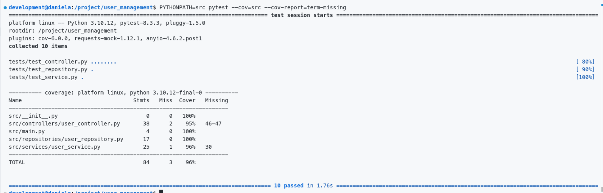
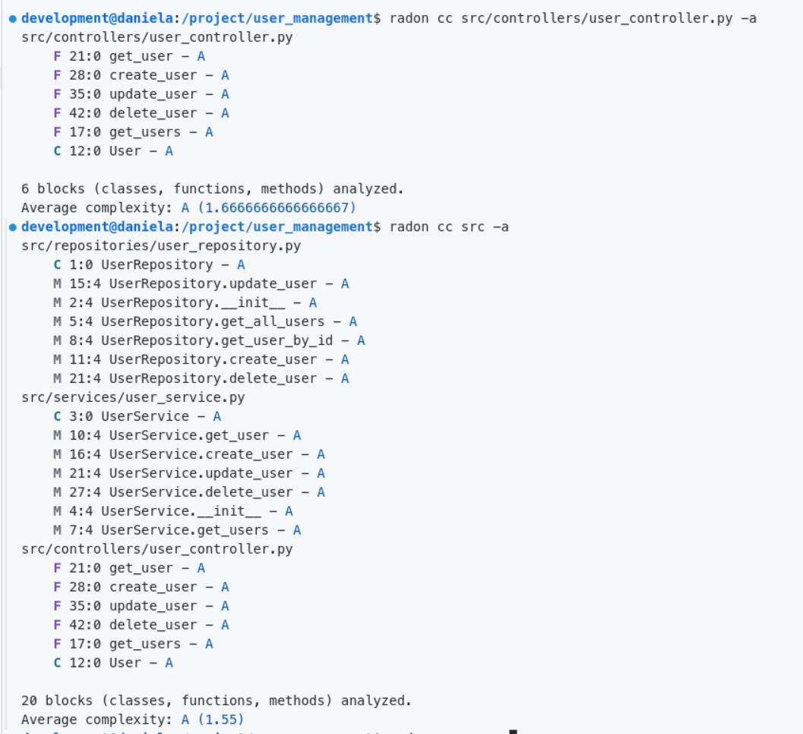

# PC4: ServiceProject

## Descripción
Este proyecto contiene dos servicios independientes conectados:
1. **Gestión de Usuarios**: Un servicio que sirve manejar usuarios.
2. **Catálogo de Productos**: Un servicio que sirve para gestionar productos y asociarlo con lso usuarios.

## Requisitos
- Docker
- Docker Compose

### Clonar el repositorio:
    ```bash
    git clone https://github.com/danicade24/Practica-Calificada-4.git

    cd ServiceProject
    ``` 

## Proyecto 1: Gestión de Usuarios

### 1. Funcionalidad

Implementamos el codigo necesario para que pueda crear, leer, eliminar y actualizar 

### Código para operaciones CRUD
```python
from fastapi import FastAPI, HTTPException

app = FastAPI()

# Almacenamos los usuarios en un diccionario
users = {}

"""Implementamos los métodos CRUD para user_management"""

# Listar todos los usuarios
@app.get("/users")
def get_users():
    return {"users": users}  # Devuelve un diccionario con la clave "users"

# Obtener usuario por ID
@app.get("/users/{user_id}")
def get_user(user_id: str):
    user = users.get(user_id)
    if not user:
        raise HTTPException(status_code=404, detail="Usuario no encontrado")
    return {"user": user}  # Devuelve un diccionario con la clave "user"

# Crear usuario
@app.post("/users")
def create_user(user_id: str, name: str):
    if user_id in users:  # Verifica si el usuario ya existe
        raise HTTPException(status_code=400, detail="El usuario ya existe")
    users[user_id] = {"id": user_id, "name": name}
    return {"user": users[user_id]}

# Actualizar usuario
@app.put("/users/{user_id}")
def update_user(user_id: str, name: str):
    if user_id not in users:
        raise HTTPException(status_code=404, detail="Usuario no encontrado")
    users[user_id]["name"] = name
    return {"user": users[user_id]}

# Eliminar usuario por ID
@app.delete("/users/{user_id}")
def delete_user(user_id: str):
    if user_id not in users:
        raise HTTPException(status_code=404, detail="Usuario no encontrado")
    del users[user_id]
    return {"message": "Usuario eliminado"}
```

**Endpoints:**
   - **GET `/users`:** Debería devolver un diccionario vacio al inicio.
   - **POST `/users`:** Crea un usuario con `user_id` y `name`.
   - **GET `/users/{user_id}`:** Obtiene la información de un usuario creado.
   - **PUT `/users/{user_id}`:** Actualiza el nombre de un usuario existente.
   - **DELETE `/users/{user_id}`:** Elimina un usuario.


### 2. Diseño

Se aplico los principios SOLID de la siguiente manera:

Por ejemplo, el principio de Responsabilidad única:

Los módulos lo manejan osea cada módulo (controllers, services, repositories):
- En **controllers** ese módulo es el que se encarga de manejar las solicitudes HTTP.
- En **services** ese módulo es el que maneja toda la lógica del negocio de administración de usuarios.
- En **repositories** ese módulo se encarga de almacenar los datos.


Tambien tenemos el principio de inversion de dependencias:

- Se consiguio que no se dependiera directamente de las implementaciones como tal, sino que los controladores dependan de los servicios, éstos a su vez dependan de interfaces que en este caso vienen a ser los repositorios.


### 3. Pruebas

#### **Pruebas del Proyecto**

Las pruebas se encuentran en el directorio `tests`, donde se testea el comportamiento de los controladores, servicios y repositorios. Las pruebas se realizan utilizando `pytest` y están organizadas de la siguiente manera:

#### **Archivos de prueba**
- **`test_controller.py`**: Contiene las pruebas de los controladores que gestionan las rutas de la API.
- **`test_service.py`**: Contiene las pruebas para la lógica de negocio dentro de los servicios.
- **`test_repository.py`**: Contiene las pruebas para las interacciones con la base de datos o repositorios de datos.

#### **Comando para ejecutar las pruebas**
Para ejecutar todas las pruebas y su cobertura,se usa el siguiente comando:

```bash
pytest --cov=src --cov-report=term-missing
```

Si se desea ejecutar las pruebas en un archivo específico, puedes hacerlo con el siguiente comando:

```bash
pytest tests/test_controller.py
```

#### **Cobertura de las pruebas**


#### **Descripción de las pruebas**
Las pruebas están estructuradas en casos de prueba que incluyen la creación, actualización, eliminación y obtención de usuarios. Algunas de las pruebas clave incluyen:

- **Creación de un usuario (`test_create_user`)**: Verifica que un nuevo usuario puede ser creado correctamente.
- **Obtención de un usuario por ID (`test_get_user`)**: Verifica que un usuario puede ser recuperado por su ID.
- **Actualización de un usuario (`test_update_user_success`)**: Verifica que un usuario puede ser actualizado correctamente.
- **Eliminación de un usuario (`test_delete_user`)**: Verifica que un usuario puede ser eliminado correctamente.
- **Manejo de errores**: Las pruebas también incluyen casos donde se intenta acceder o modificar un usuario que no existe (`test_update_user_not_found`, `test_update_user_invalid_body`).


### 4. Métricas

#### **Comando para calcular la complejidad ciclomática**
Para calcular la complejidad ciclomática de los archivos de tu proyecto, puedes usar **Radon** con el siguiente comando:

```bash
radon cc src -a
```

Esto analizará los archivos en el directorio `src` y genera un informe con la complejidad ciclomática, con un valor promedio para todo el proyecto.



 **Interpretación de la complejidad ciclomática**
 Vemos que nos Sale A eso quiere decir que es de **baja complejidad**, es decir, El código es fácil de entender y mantener.

---


1. **`src/controllers/user_controller.py`**
   - Funciones: `get_user`, `create_user`, `update_user`, `delete_user`, `get_users`

   
   **Promedio de complejidad**: A (1.6667)

2. **`src/repositories/user_repository.py`**
   - Métodos: `UserRepository.update_user`, `UserRepository.__init__`, `UserRepository.get_all_users`, `UserRepository.get_user_by_id`, `UserRepository.create_user`, `UserRepository.delete_user`

   **Promedio de complejidad**: A (1)

3. **`src/services/user_service.py`**
   - Métodos: `UserService.get_user`, `UserService.create_user`, `UserService.update_user`, `UserService.delete_user`, `UserService.get_users`, `UserService.__init__`


   **Promedio de complejidad**: A (1)

---

#### **Análisis de la Complejidad Ciclomática**
- **Promedio general del proyecto**: A (1.55)
- La **complejidad ciclomática** de todo el proyecto es baja, lo cual sugiere que el código está bien estructurado y es fácil de mantener. La mayoría de las funciones tienen una complejidad de 1, lo que significa que cada una realiza una tarea sencilla y directa sin lógica compleja o condicionales anidadas.

### **Conclusión**
La baja complejidad ciclomática en el proyecto es un nos da a entender de que el código es limpio y fácil de mantener. S

## Proyecto 2: Catálogo de Productos

### 1. Funcionalidad

### 2. Diseño

### 3. Pruebas

### 4. Métricas


### Nota: El avance ha sido ejecutado todo el tiempo dentro de un devcontainer